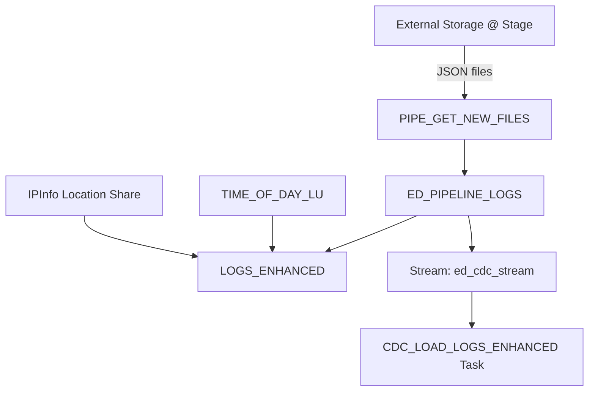

# 🎮 Game Event Logging Pipeline with Snowflake

This project implements a **real-time event logging pipeline** for tracking user activity in a gaming environment using **Snowflake**. It automates the ingestion, enhancement, and continuous integration of raw JSON logs with geolocation and time-of-day metadata.

## 📂 Project Structure

* **Raw Logs** are ingested from cloud storage using Snowflake's external stage and file format.
* **Views** transform raw JSON into structured form.
* **Tables** store enriched game log data.
* **Tasks** automate the periodic ingestion, enhancement, and CDC-based updates.
* **Streams & Pipes** enable near real-time ingestion and processing.

---

## 🚀 Features

* **JSON Log Ingestion** from AWS using `COPY INTO` and Snowflake pipes
* **IP Geolocation Enrichment** using a shared IP info dataset
* **Time-of-Day Classification** to segment behavior across day periods
* **Task Scheduling** for regular and CDC-based data loads
* **Pipeline Metadata Logging** using Snowflake metadata columns
* **Automated Stream Processing** via Snowflake Streams and Managed Tasks

---

## 🧱 Schema Overview

### Tables

* `PL_GAME_LOGS`: Raw logs loaded from pipeline
* `ED_PIPELINE_LOGS`: Metadata-enhanced raw logs with parsing
* `LOGS_ENHANCED`: Final enriched logs with location and time context
* `TIME_OF_DAY_LU`: Lookup table mapping hours to descriptive periods of day

### Views

* `LOGS`, `PL_LOGS`: Extracted and filtered views from variant JSON

---

## 🔁 Data Flow



---

## ⚙️ Key Automation Tasks

### 1. `GET_NEW_FILES`

* **Schedule:** Every 5 minutes
* **Function:** Load new JSON logs into `PL_GAME_LOGS` from stage

### 2. `LOAD_LOGS_ENHANCED`

* **Schedule:** Every 5 minutes
* **Function:** Merge enriched data from `ED_PIPELINE_LOGS` into `LOGS_ENHANCED`

### 3. `CDC_LOAD_LOGS_ENHANCED`

* **Schedule:** On-change (via stream)
* **Function:** Merge only changed rows from `ed_cdc_stream` to `LOGS_ENHANCED`

---

## 🔍 Testing Steps

You can validate the pipeline with:

```sql
-- Check files in the stage
LIST @AGS_GAME_AUDIENCE.RAW.UNI_KISHORE_PIPELINE;

-- Row counts
SELECT COUNT(*) FROM PL_GAME_LOGS;
SELECT COUNT(*) FROM ED_PIPELINE_LOGS;
SELECT COUNT(*) FROM LOGS_ENHANCED;
```

---

## 🔐 Permissions Setup

Ensure role-based execution permissions:

```sql
USE ROLE ACCOUNTADMIN;
GRANT EXECUTE TASK ON ACCOUNT TO ROLE SYSADMIN;
GRANT EXECUTE MANAGED TASK ON ACCOUNT TO SYSADMIN;
```

---

## 🧪 Sample Data Enhancements

Each event is enriched with:

* **Gamer’s Location**: City, Region, Country
* **Local Time Zone Conversion**
* **Day of Week and Time Period Label**

---

## 📅 Time of Day Mapping

| Period          | Hours   |
| --------------- | ------- |
| Early morning   | 6 – 8   |
| Mid-morning     | 9 – 10  |
| Late morning    | 11 – 12 |
| Early afternoon | 13 – 14 |
| Mid-afternoon   | 15 – 16 |
| Late afternoon  | 17 – 18 |
| Early evening   | 19 – 20 |
| Late evening    | 21 – 23 |
| Late at night   | 0 – 2   |
| Toward morning  | 3 – 5   |

---

## 📌 Requirements

* Snowflake account
* Access to external stage with JSON logs
* IP geolocation shared dataset (e.g. `IPINFO_GEOLOC`)
* Optional: AWS SNS topic for auto-ingestion

---

## ✅ To Do

* [ ] Add alerting on failed tasks
* [ ] Visualize metrics in Snowsight or Power BI
* [ ] Add retention policy or partitioning for enhanced logs

---
